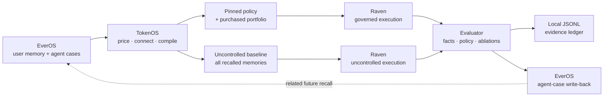

# TokenOS

**TokenOS is an Economic Memory Compiler.** It gives Raven the cheapest safe memory portfolio that preserves the right decision, then proves which memories earned their token cost.

> Every memory has a token price.

Persistent agents become more expensive as their memory grows. Similarity search can find memories related to a task, but it cannot answer the economic question TokenOS is built around:

> What is the cheapest safe combination of memories that still produces the right outcome?

TokenOS retrieves candidate memory from EverOS, pins non-negotiable policy, prices each memory's marginal value, evaluates the relationship graph, and searches for the best feasible portfolio under an exact token budget. It then runs an uncontrolled all-memory baseline and a governed purchased-memory variant through the same Raven execution contract. The result is evidence, not a claim: token counts, preserved facts and policy, causal ablations, a local run ledger, and an EverOS agent-case learning receipt.

## Why this is not ordinary RAG

| | Ordinary retrieval | TokenOS |
|---|---|---|
| Primary objective | Find similar context | Buy outcome value per token |
| Selection | Usually independent top-k items | A constrained memory portfolio |
| Relationships | Often ignored after ranking | Duplicate, contradiction, dependency, and complement edges affect the portfolio |
| Safety | A relevant policy can lose the ranking contest | Critical policy is pinned and budgets below the safe floor are refused |
| Proof | Retrieval score | Controlled Raven A/B, evaluator checks, and counterfactual ablations |
| Feedback | Store another conversation | Write an agent case and apply its historical outcome lift on a related run |

Top-k embeddings can return five versions of the same fact, a stale runbook, or a contradiction. TokenOS reasons about the set: whether a memory adds missing coverage, depends on another memory, complements evidence already purchased, or is redundant once a stronger source is present.

## Architecture



The two Raven paths hold runtime, model, task fingerprint, tools, temperature, and output limit constant. Only the memory context changes:

- The **uncontrolled** run receives every recalled memory.
- The **governed** run receives only pinned and purchased memories.

That controlled comparison is why a token delta is attributable to memory governance instead of a model or prompt-setting change.

## What the incident demo proves

The production-incident replay contains exactly 15 candidate memories, so TokenOS evaluates every one of the `2^15 = 32,768` possible portfolios. The normal demo contract selects a four-memory governed portfolio: the pinned business-hours safety policy plus the memories needed to preserve the decision facts. The interface exposes every purchase and rejection, including duplicate, contradiction, dependency, complement, stale, irrelevant, and low-value decisions.

The proof sequence is:

1. Raven receives all 15 memories in the uncontrolled run.
2. The governed run receives only the four purchased memories under the normal contract.
3. Input, output, and total tokens are recorded for both variants.
4. Required facts and policy pass in the governed result.
5. Removing the pinned policy fails the safety proof.
6. Removing an irrelevant rejected control produces no material outcome change.
7. A budget below the computed floor is refused before Raven starts.
8. The returned minimum-safe budget can be applied with one click and the rerun succeeds.
9. A completed run creates a learning receipt; the next related run can surface the learned case with historical outcome lift.

The optimized answer is visible, but it is secondary to the economic proof.

## Runtime truth: replay and live are different modes

TokenOS reports EverOS and Raven status independently. A live label is never inferred merely because a credential exists.

| Configuration | Recall and write-back | Raven execution | Token accounting |
|---|---|---|---|
| `EVEROS_MODE=replay`, `RAVEN_MODE=replay` | Deterministic workspace memory and local learning | Deterministic replay | Deterministic estimates, marked estimated |
| `EVEROS_MODE=live`, `RAVEN_MODE=replay` | Live EverOS when the request succeeds; explicitly labeled replay if recall fails | Deterministic replay | Deterministic estimates, marked estimated |
| `EVEROS_MODE=replay`, `RAVEN_MODE=live` | Workspace memory and local learning | Installed Raven CLI | Measured from Raven usage telemetry |
| `EVEROS_MODE=live`, `RAVEN_MODE=live` | Live EverOS when available | Installed Raven CLI | Measured from Raven usage telemetry |

Credentials alone activate no network path. Live EverOS requires both `EVEROS_MODE=live` and `EVEROS_API_KEY`; live Raven requires `RAVEN_MODE=live`, an installed and onboarded Raven CLI, a working Raven model provider, and measured usage in Raven's isolated trace. Failed EverOS recall is explicitly labeled replay; failed live Raven execution returns an error. Neither is mislabeled live. Replay results demonstrate deterministic product behavior and optimizer correctness, not live-provider performance.

## Quick start: deterministic replay

Prerequisites: Node.js 20.19+ or 22.12+ and npm (the versions supported by Vite 7).

```bash
git clone https://github.com/FlyingPotato437/TokenOS.git
cd TokenOS
npm install
cp .env.example .env
npm run dev
```

Open [http://localhost:5173](http://localhost:5173). The API listens on `127.0.0.1:8787` by default, and Vite proxies `/api` requests during development. Replay mode requires no external credentials.

To run the production server instead of the two-process development server:

```bash
npm run build
npm start
```

## Live EverOS setup

1. Create an EverOS API key.
2. Copy `.env.example` to `.env`, set `EVEROS_MODE=live`, and set `EVEROS_API_KEY`.
3. Keep stable `EVEROS_USER_ID`, `EVEROS_AGENT_ID`, `EVEROS_APP_ID`, and `EVEROS_PROJECT_ID` values so recall and agent-case write-back use the same memory spaces.
4. Start TokenOS and inspect the provider labels in the interface or `GET /api/health`.

TokenOS searches user memory and Raven agent memory separately, then merges live results with deterministic workspace safety anchors when needed. That hybrid provenance is labeled rather than presented as provider-only recall. After a successful governed run it writes an agent case to EverOS. If EverOS is absent or unavailable, the same learning receipt is persisted locally and the provider is labeled accordingly.

## Live Raven setup

Install Raven using its [official setup](https://github.com/EverMind-AI/Raven), then onboard and verify a model provider:

```bash
curl -fsSL https://raven.evermind.ai/install.sh | bash
raven onboard
raven doctor
raven agent -m "Raven connectivity check"
```

Then configure TokenOS:

```dotenv
RAVEN_MODE=live
RAVEN_COMMAND=raven
```

Use the optional model, config, workspace, and timeout variables only when your Raven installation needs explicit overrides. TokenOS invokes the same Raven binary and execution contract for uncontrolled and governed variants. Each invocation receives its own trace directory. A live run is accepted only when Raven completes and TokenOS can read input, output, and total-token usage from the new LLM trace (or from a compatible structured wrapper response). Missing live usage is not silently replaced with an estimate.

## Environment variables

`.env.example` is the complete application environment contract.

| Variable | Required | Mode | What it controls | If absent |
|---|---:|---|---|---|
| `PORT` | No | All | Local API port | Uses `8787` |
| `EVEROS_MODE` | No | EverOS | Selects `replay` or `live` recall/write-back | Uses `replay`; no EverOS network calls |
| `EVEROS_API_KEY` | Live EverOS only | EverOS | Bearer credential for recall and agent-case write-back | Live recall is labeled replay; replay mode is unaffected |
| `EVEROS_BASE_URL` | No | Live EverOS | EverOS API origin | Uses `https://api.evermind.ai` |
| `EVEROS_USER_ID` | No | Live EverOS | User-memory namespace | Uses the demo user ID |
| `EVEROS_AGENT_ID` | No | Live EverOS | Raven agent-memory namespace | Uses the demo Raven agent ID |
| `EVEROS_APP_ID` | No | Live EverOS | EverOS application scope | Uses the demo application ID |
| `EVEROS_PROJECT_ID` | No | Live EverOS | EverOS project scope | Uses the demo project ID |
| `RAVEN_MODE` | No | Raven | Selects `replay` or `live` execution | Uses `replay` |
| `RAVEN_COMMAND` | No | Live Raven | Raven executable path or command | Uses `raven` from `PATH` |
| `RAVEN_MODEL` | No | Live Raven | Fixed model override for both A/B variants | Keeps the fixed TokenOS execution-contract model |
| `RAVEN_CONFIG_PATH` | No | Live Raven | Explicit Raven configuration path | Uses Raven's configured default |
| `RAVEN_WORKSPACE` | No | Live Raven | Explicit Raven workspace | Uses Raven's configured default |
| `RAVEN_TIMEOUT_MS` | No | Live Raven | Per-execution timeout | Uses `120000` ms |
| `TOKENOS_LEDGER_PATH` | No | All | Append-only run evidence and historical-lift ledger; `:memory:` disables disk writes | Uses `.tokenos/run-ledger.jsonl` |

Never commit `.env`. It is ignored by Git.

## Exact optimizer

TokenOS performs exact subset enumeration for the bounded demo catalog; it is not a heuristic top-k pass.

1. **Recall.** Build the candidate set and keep the incident contract at 15 memories.
2. **Price.** For each selected memory `i`, compute `(successLiftᵢ + historicalOutcomeLiftᵢ) × relevanceᵢ × confidenceᵢ × (0.62 + 0.38 × recencyᵢ)`. Missing recency defaults to `0.72`.
3. **Connect.** Sum those values into `L`, subtract `0.022 × strength` for each selected duplicate pair and `0.075 × strength` for each selected contradiction pair, and add `0.012 × strength` for each selected complement pair. Low relevance and recency add small distraction penalties. A selected memory with an unmet dependency makes the portfolio infeasible; a contradiction involving pinned policy also makes it infeasible.
4. **Estimate outcome.** Compute `clamp(0.78 + (1 - exp(-1.7L)) × 0.19 + complement lift - graph and distraction penalties, 0.05, 0.99)`.
5. **Constrain.** Reject portfolios that exceed the exact memory budget, miss the outcome floor, omit a pinned policy, lose a required fact, or violate a dependency. This happens before Raven execution.
6. **Rank.** Economy, balanced, and quality apply different weights to outcome probability, token share, selected count, and historical lift. Economy penalizes token share most; quality weights outcome probability most; balanced sits between them. Strategy never changes model, runtime, task, tool set, or generation settings. The exact coefficients live in `server/optimizer.ts` and are covered by acceptance tests.
7. **Explain.** Compute utility per 1,000 tokens from the memory's relevance, confidence, expected lift, historical lift, and token count, then attach a concrete purchase or rejection reason.
8. **Prove.** Execute the all-memory baseline and governed winner, then evaluate pinned, purchased, and rejected-control ablation plans structurally against the same safety and fact gates.

The fixed Raven tools are part of the controlled execution contract, not items in the memory auction. This hackathon build deliberately optimizes memory only.

For 15 incident memories, exhaustive search is small and auditable. A production version can replace enumeration with branch-and-bound or an integer solver without changing the safety and evidence contracts; those solvers are not implemented here.

## Local evidence and learning

Every completed run is appended as one compact JSON object per line to `.tokenos/run-ledger.jsonl` by default. Each entry records:

- run ID, scenario, objective, and timestamp;
- selected and all-memory IDs plus their memory-token totals;
- uncontrolled and governed Raven input tokens plus the reduction;
- policy and required-fact results;
- whether measurement was estimated; and
- the reusable lesson for historical-lift scoring.

The same file is read after restart to recover historical-lift signals. `GET /api/runs` exposes the current process's recent full run results; the JSONL file is the durable compact A/B and learning ledger. This is deterministic evidence reuse, not online model training or reinforcement learning.

See [docs/EVIDENCE.md](docs/EVIDENCE.md) for the on-disk and live/replay evidence contract.

## API and streamed lifecycle

- `GET /api/health` — service and independent provider status.
- `GET /api/scenarios` — the three demo contracts.
- `GET /api/runs` — recent full results from the current API process.
- `POST /api/run` — validated run request and newline-delimited streamed events.

The run stream orders recall, pricing, graph connection, compilation, Raven execution, comparison, learning, and completion. An unsafe budget terminates with `compile.refused` before any `raven.started` event.

## Verification

```bash
npm install
npm run lint
npm test
npm run build
npm run smoke
npm run check
```

The acceptance suite covers the exact 32,768-portfolio incident search, the four-item governed contract, all graph decision types, strategy tradeoffs, controlled Raven A/B invariants, usage recording, truthful provider labels, pre-Raven refusal and safe-floor recovery, EverOS-shaped agent-case write-back, next-run historical lift, disk ledger persistence, validation, stream order, and all three scenarios. A repository guard also rejects active legacy provider language.

## Demo and judge material

- [Three-minute demo script](docs/DEMO_SCRIPT.md)
- [Judge Q&A](docs/JUDGE_QA.md)
- [Submission copy](docs/SUBMISSION.md)

## Honest boundaries

- Replay token usage is deterministic and explicitly estimated. Only successful Raven telemetry is labeled measured/live.
- The scenario evaluator checks declared policies, facts, tools, and answer completeness; it is not a universal correctness oracle.
- Historical lift is an explicit scoring signal from a prior case. TokenOS does not train a model or claim autonomous reinforcement learning.
- Exact power-set search is appropriate for the 15-memory demonstration, not an assertion that exhaustive enumeration is the only production solver.
