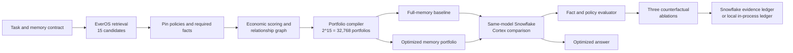

# TokenOS

**TokenOS is an Economic Memory Compiler.**

It finds the cheapest safe combination of memories that changes the answer. Persistent agents become more expensive as their histories grow; TokenOS turns that passive archive into a managed economic resource and asks one practical question:

> What is the cheapest combination of memories that still produces the right decision?

The proof is deliberately controlled. A full-memory baseline and a compiled-memory run use the same task, Cortex model, generation settings, and tools. Only the memory context changes. TokenOS then checks that required facts and policy survived, runs counterfactual ablations, and records the evidence.

## Why this is not ordinary RAG

| Ordinary retrieval | TokenOS |
| --- | --- |
| Ranks individual memories by similarity | Values memories by marginal outcome utility per token |
| Usually returns a fixed top-k list | Searches complete portfolios under an explicit contract |
| Treats retrieved items mostly independently | Models duplicates, contradictions, dependencies, and complements |
| Has no economic proof that rejected context was unnecessary | Compares same-model token/cost use and runs ablations |
| May retrieve a policy because it is relevant | Pins safety-critical memory and rejects unsafe portfolios |

Embedding relevance remains one input. It is not the objective. A highly relevant memory can be redundant, a moderately relevant memory can complete a required fact, and two useful memories can become valuable only together.

## Architecture



## What the repository implements

### 1. EverOS retrieval

The incident scenario supplies 15 deterministic candidates in demo mode. With `EVEROS_API_KEY` configured, the provider calls EverOS v2 hybrid search with `top_k: 15` and profile inclusion. Safety policies and required-fact anchors from the workspace are retained, live results are merged in, and the set is capped at 15. After a successful run, TokenOS attempts to write the optimized interaction back to EverOS for consolidation.

If EverOS is absent, returns no matches, or fails, the API uses the deterministic workspace set and labels the provider mode `demo` or `fallback`.

### 2. Marginal value scoring

Each memory contributes task relevance, token cost, source confidence, recency, historical success lift, and required-fact coverage. The compiler applies diminishing returns to accumulated memory lift, then adds relationship effects. For the final selected plan, displayed utility per 1,000 tokens is counterfactual: the selected portfolio is compared with the same set after removing or adding that one memory.

The current implementation uses fixed catalog signals. It records outcome evidence, but it does **not** yet train or automatically update those signals.

### 3. Memory relationship graph

The catalog supports four directed relationships:

- `duplicate`: penalizes paying twice for overlapping evidence.
- `contradicts`: penalizes incompatible context, including stale advice that conflicts with policy.
- `depends_on`: makes a portfolio infeasible when a selected memory lacks its prerequisite.
- `complements`: adds value when two memories become more useful together.

Every memory is surfaced as pinned, purchased, rejected as redundant, rejected as contradictory, rejected for low marginal value, or rejected as irrelevant.

### 4. Constrained portfolio optimization

For 15 incident memories, the compiler exhaustively evaluates all `2^15 = 32,768` memory subsets. The Cortex model and required tool set stay fixed. Portfolios are rejected when they violate the memory-token budget, Cortex cost ceiling, quality floor, latency SLA, region policy, required-fact coverage, pinned-memory policy, or dependencies.

The remaining portfolios are ranked for the selected economy, balanced, or quality strategy. TokenOS also exposes a Pareto frontier across memory tokens, expected quality, latency, and cost. If no safe portfolio fits, the API emits `run.error` with the minimum safe memory-token budget and cost instead of attempting inference.

### 5. Same-model Cortex comparison

The baseline sends all 15 memories. The optimized run sends only the selected portfolio. Both use the same objective, fixed required tools, model ID, temperature (`0`), and maximum completion tokens (`600`). The comparison records prompt tokens, completion tokens, cost, evaluation results, reduction percentages, model identity, generation config, and measurement mode.

In live Cortex mode, token counts come from the Cortex response when supplied, and the application calculates cost from those counts and the catalog rate. In deterministic mode, token counts and cost are reproducible local estimates and `usage.estimated` is `true`. Demo estimates must not be presented as live provider measurements or billing data.

### 6. Counterfactual ablations

TokenOS executes exactly three same-model counterfactuals:

1. Remove the pinned safety memory from the optimized plan. The policy proof must fail.
2. Remove the highest-value non-policy memory from the optimized plan. The expected outcome should degrade.
3. Remove an irrelevant rejected memory from the full baseline. Policy, required facts, and outcome should not materially change.

These tests supply causal evidence for both sides of the decision: critical memories matter, while rejected control context does not.

### 7. Snowflake evidence ledger

The final run record includes the baseline, optimized plan, memory decisions, actual or estimated usage marker, evaluation checks, relationships, generation config, and counterfactuals. Without SQL configuration, the record remains available from the in-process `GET /api/runs` ledger. With Snowflake SQL configured, TokenOS creates the configured table if needed and inserts the evidence through the SQL API. A SQL failure is labeled `fallback` and does not erase the completed run.

## Runtime modes

These modes are independent, so mixed configurations are valid.

| Mode | Enable it | What is real | Behavior when absent or failing |
| --- | --- | --- | --- |
| Deterministic demo | Leave provider credentials empty | Local optimizer, evaluator, API stream, and fixed replay data | Default. Uses catalog memories, a fixed answer, estimated token/cost usage, and the in-process ledger. No external requests or credentials. |
| Live EverOS | Set `EVEROS_API_KEY`; optionally set base URL and user ID | Retrieval and post-run interaction writeback | Missing key uses demo retrieval. Provider errors use the deterministic set with mode `fallback`. |
| Live Snowflake Cortex | Set `SNOWFLAKE_ACCOUNT_URL` and `SNOWFLAKE_PAT` | Cortex inference and provider-reported token usage when returned | Missing credentials use deterministic inference. Provider errors return a labeled deterministic fallback. |
| Live Snowflake SQL ledger | Also set `SNOWFLAKE_DATABASE` and `SNOWFLAKE_SCHEMA` | SQL table creation and run-evidence inserts | Missing database/schema keeps an in-process ledger. SQL errors return ledger mode `fallback`. |

Provider status is returned by `GET /api/health`. Run evidence also carries `providers`, `comparison.measurementMode`, and `usage.estimated`; use those fields to distinguish live evidence from replay estimates.

## Quick start

Requirements: a current Node.js release with built-in `fetch` support (Node 20 or newer is recommended) and npm.

```bash
git clone https://github.com/FlyingPotato437/TokenOS.git
cd TokenOS
npm install
cp .env.example .env
npm run dev
```

Open [http://localhost:5173](http://localhost:5173). `npm run dev` starts the API and web app together. The API listens on `http://127.0.0.1:8787` by default, and Vite proxies `/api` to it.

To run only the API:

```bash
npm start
```

## Verification

```bash
npm install
npm run lint
npm run build
npm run smoke
```

`npm run smoke` starts its own local API on an ephemeral port, explicitly disables all provider credentials for that child process, exercises the normal incident run and an impossible-budget run, and shuts the API down. No `.env`, credentials, browser, or separately running server is required.

The harness verifies:

- health and deterministic provider mode;
- exactly 15 retrieved memories and 32,768 evaluated portfolios;
- the same model for baseline and optimized execution;
- lower optimized prompt tokens and Cortex cost;
- preserved required facts;
- exactly three counterfactuals;
- failure of the pinned-policy ablation;
- no material change from the rejected-memory control;
- safe refusal with the minimum safe token budget.

Any failed assertion prints the expected and observed values and exits nonzero.

## Configuration reference

All environment variables used by the repository are listed below and annotated in `.env.example`.

| Variable | Required | Mode and behavior |
| --- | --- | --- |
| `PORT` | No | Local API port. Defaults to `8787`. |
| `EVEROS_API_KEY` | Live EverOS only | Enables live search and writeback. Empty means deterministic retrieval. |
| `EVEROS_BASE_URL` | No | EverOS API origin. Defaults to `https://api.evermind.ai`. |
| `EVEROS_USER_ID` | No | EverOS search user and writeback sender. Defaults to `tokenos-demo-user`. |
| `SNOWFLAKE_ACCOUNT_URL` | Live Cortex and SQL | Snowflake account origin. Without a PAT, Cortex remains deterministic and SQL remains local. |
| `SNOWFLAKE_PAT` | Live Cortex and SQL | Programmatic access token. Never needed for demo mode. |
| `SNOWFLAKE_DATABASE` | Live SQL only | Existing database for the evidence table. Absence keeps the ledger in process. |
| `SNOWFLAKE_SCHEMA` | Live SQL only | Existing schema for the evidence table. Absence keeps the ledger in process. |
| `SNOWFLAKE_WAREHOUSE` | No | Optional warehouse sent to SQL statements; Snowflake session defaults apply when empty. |
| `SNOWFLAKE_ROLE` | No | Optional role sent to SQL statements; Snowflake session defaults apply when empty. |
| `SNOWFLAKE_LEDGER_TABLE` | No | Evidence table name. Defaults to `TOKENOS_RUN_LEDGER`. |
| `TOKENOS_FORCE_MODEL` | No | Overrides the model ID used for both Cortex variants. The compiler-selected fixed model is used when empty. |

The Snowflake database and schema must already exist. Identifiers must begin with a letter or underscore and contain only letters, numbers, underscores, or `$`.

## Local API

- `GET /api/health`: service and provider modes.
- `GET /api/scenarios`: available demo scenarios.
- `POST /api/run`: NDJSON experiment stream.
- `GET /api/runs`: up to ten completed runs held in process.

The run stream advances through retrieve, pin, compile, compare, ablate, and record phases. A completed run ends with `ledger.completed`; an infeasible contract ends safely with `run.error` and compile evidence.

## Demo and submission material

- [Three-minute judging script](docs/demo-script.md)
- [Judge question guide](docs/judge-questions.md)

## Scope

This hackathon build focuses only on memory economics: retrieval, memory utility, portfolio optimization, controlled same-model execution, evaluation, ablations, and evidence recording. It does not implement model routing, reasoning-budget allocation, tool-value optimization, escalation policy learning, reinforcement learning, or automatic utility updates.
